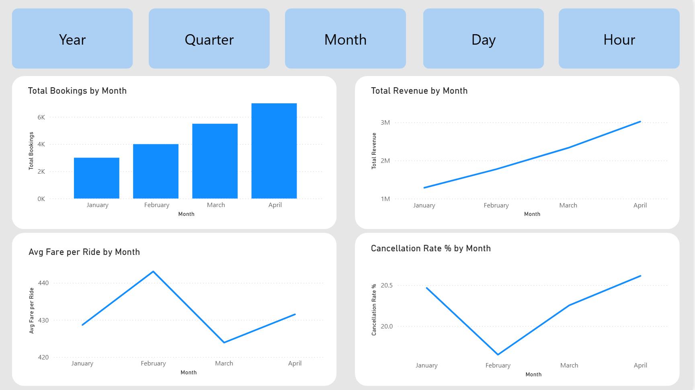
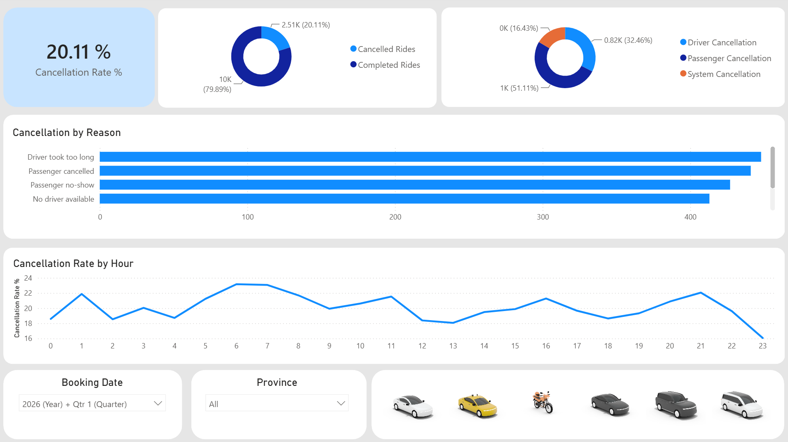
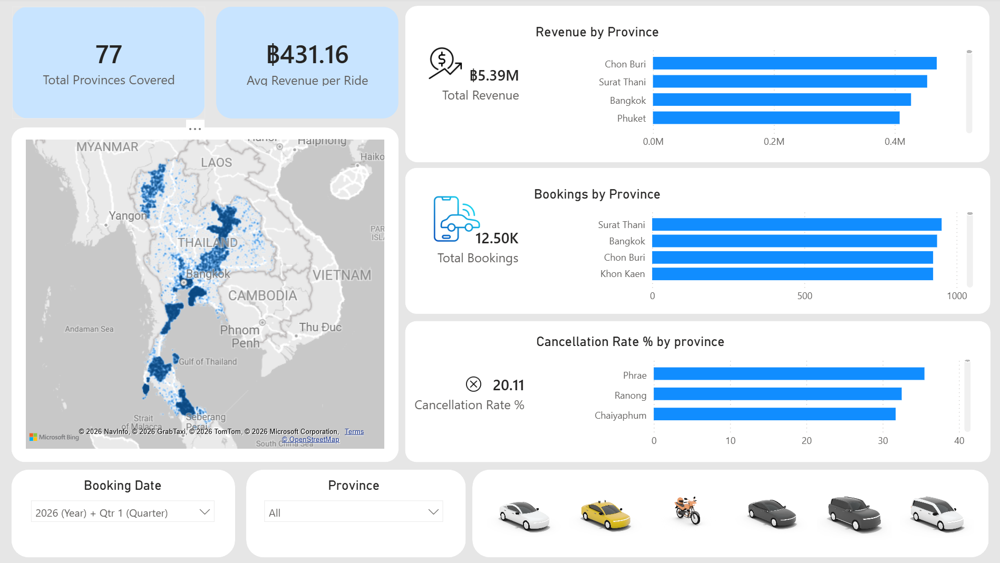
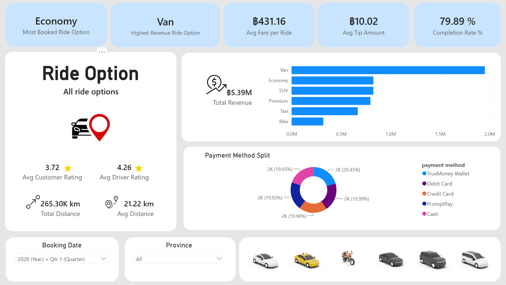
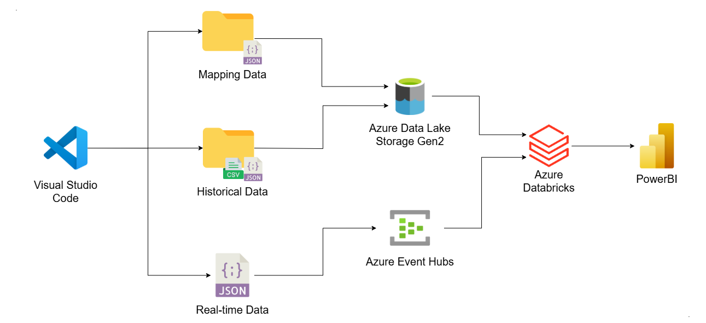
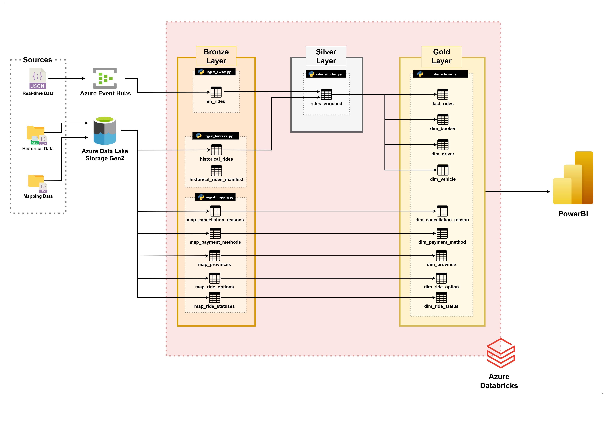
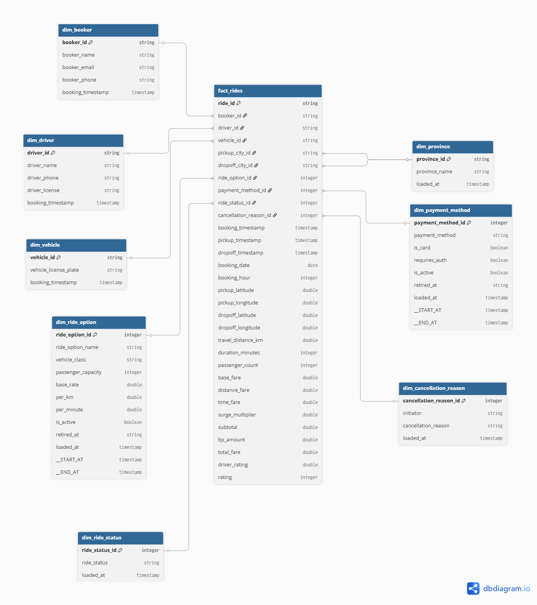
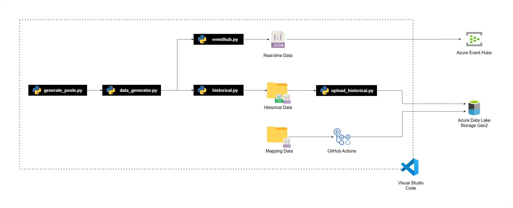

# 🚕 End-to-End Ride-Hailing Data Pipeline (Thailand)

## 📊 Dashboard

4-page interactive dashboard built on the Gold layer star schema.

| Page | Business Question |
|---|---|
| 📈 **Growth** | Is the business growing sustainably and moving in the right direction?|
| ❌ **Cancellation & Service Quality** | What factors are driving ride cancellation, and where are service improvements needed? |
| 🗺️ **Geographic Performance** | Which regions are performing best, and where should future investments or expansion be focused? |
| 💰 **Ride Option & Revenue** | Which ride option generate the highest revenue, and which require strategic attention? |

> Note: The dashboard data is generated for demonstration purposes and does not represent real-world figures, which is why some visuals may not make sense.

### 📈 Growth


### ❌ Cancellation & Service Quality


### 🗺️ Geographic Performance


### 💰 Ride Option & Revenue


---

## 💡 Why I Built This

I have been interested in data engineering for some time. In my previous work, I often extracted, validated, cleaned, and loaded data manually, repeating the same process whenever new data became available. While this approach was effective for smaller workloads, it was time-consuming, difficult to maintain, and not easily scalable.

To better understand how modern data platforms automate these processes, I wanted to gain hands-on experience with the tools, architectures, and workflows used in production environments. As a result, I built this project to design and implement an end-to-end data pipeline that moves raw data through ingestion, transformation, and visualization, delivering insights through an interactive dashboard.

I designed this project around two real-world pipeline scenarios:

**Scenario 1 - Real-time ingestion:** Rides data are streamed live to Azure Event Hubs, simulating a production system where data must be captured and processed continuously as it arrives.

**Scenario 2 - System migration:** The business has historical ride data from a previous system that must be migrated into the new pipeline.

The pipeline is built around a simulated Thai ride-hailing business, using real Thai geographic coordinates across all 77 provinces, Thai address data from a a self-hosted Nominatim (OpenStreetMap) instance.

---

## 🔎 Overview



---

## 📋 Table of Contents

- [Dashboard](#-dashboard)
- [Data Pipeline Architecture](#-data-pipeline-architecture)
- [Data Structure](#-data-structure)
- [Data Generator](#️-data-generator)
- [Project Structure](#️-project-structure)
- [Setup](#-setup)
- [References](#-references)

---

## 🔄 Data Pipeline Architecture



The data architecture for this project follows the Medallion Architecture with Bronze, Silver, and Gold layers.

### 🥉 Bronze - Raw Ingestion

- **`ingest_events.py`** connects to Azure Event Hubs via Kafka and stores each message as a raw JSON string in `eh_rides`, parsing happens downstream in Silver.
- **`ingest_historical.py`** creates a `historical_rides_manifest` table to track every loaded file by path and file size, so only new or replaced files are ever loaded.
- **`ingest_mapping.py`** detects changes by hashing each row's content with SHA-256 and comparing it against the last known version in the target table so only new or changed rows are appended.

### 🥈 Silver - Enrichment & Privacy

- **`rides_enriched.py`** merges `eh_rides` and `historical_rides` into a single table, casts timestamp strings to proper `TIMESTAMP` types, and replaces 7 personal identification information(PII) fields (names, emails, phones, license numbers) with SHA-256 hashes.

> There is no data cleansing in this layer because the data generator always produces clean, well-formed records. In a real-world pipeline this is where null handling, deduplication, and format validation would live.

### 🥇 Gold - Star Schema



- **`star_schema.py`** builds the full star schema from `rides_enriched` and the bronze mapping tables.
- **`dim_booker`, `dim_driver`, `dim_vehicle`** are SCD Type 1 - always reflects the latest value, no history kept.
- **`dim_ride_option`, `dim_payment_method`** are SCD Type 2 - full history is kept so old rides always link to the correct version at the time of booking.
- **`dim_province`, `dim_ride_status`, `dim_cancellation_reason`** are static reference tables loaded directly from bronze.
- **`fact_rides`** stores one row per ride with all foreign keys, timestamps, fare breakdown, distance, duration, and ratings.

---

## 📖 Data Structure

| Layer | File |
|---|---|
| Sources | [data_sources.md](docs/data_sources.md) |
| Bronze | [data_bronze.md](docs/data_bronze.md) |
| Silver | [data_silver.md](docs/data_silver.md) |
| Gold | [data_gold.md](docs/data_gold.md) |

---

## ⚙️ Data Generator



**Step 1 - Generate pools (`generate_pools.py`)**

Before any rides can be generated, a pool of drivers and customers must be created. `generate_pools.py` generates a configurable number of unique drivers and customers and saves them to files. The generator reuses these pools across runs so that the same people appear in multiple rides, simulating real repeat users and drivers.

**Step 2 - Generate rides (`data_generator.py`)**

Once the pools are ready, `data_generator.py` generates ride records using real Thai geographic coordinates validated against a self-hosted Nominatim (OpenStreetMap) instance. Two modes are used:

- **`eventhub` mode** - streams live ride records one by one to Azure Event Hubs as JSON. Simulates real-time ride records.
- **`historical` mode** - generates a batch of rides within a given date range and saves them as CSV or JSON files locally. Used to generate historical data.

After historical files are generated, `upload_historical.py` uploads them to Azure Data Lake Storage Gen2, where they are picked up by the Bronze ingestion pipeline.

**Mapping data - GitHub Actions**

Province, ride option, and payment method reference files are stored in the repository under `data/mapping_data/`. A GitHub Actions workflow automatically uploads these JSON files to Azure Data Lake Storage Gen2 whenever they are updated in the repository.

See [commands.md](docs/commands.md) for the full list of commands.

---

## 🗂️ Project Structure

```
thailand-ride-hailing-project/
├── azure_databricks/                                       # Azure Databricks pipeline notebooks
│   ├── pipeline-bronze/
│   │   ├── ingest_historical.py                            # Incremental batch load for historical ride files
│   │   ├── ingest_mapping.py                               # Change-detected append for mapping tables
│   │   └── pipeline-bronze-ingestion/transformations/
│   │       └── ingest_events.py                            # DLT streaming append from Azure Event Hubs
│   ├── pipeline-silver/
│   │   └── pipeline-silver-enriched/transformations/
│   │       └── rides_enriched.py                           # Merge, cast timestamps, hash PII
│   └── pipeline-gold/
│       └── pipeline-gold-star-schema/transformations/
│           └── star_schema.py                              # Build star schema (dim_* + fact_rides)
├── generator/                     # Data generation logic
│   ├── core.py                    # Ride record simulation
│   ├── geocoding.py               # Nominatim reverse geocoding
│   ├── config.py                  # Probabilities and parameters
│   ├── pool.py                    # Driver and customer pool generation
│   ├── loader.py                  # Mapping data loader
│   └── modes/
│       ├── generate.py            # Terminal output mode
│       ├── historical.py          # File output mode
│       └── eventhub.py            # Azure Event Hub streaming mode
├── settings/
│   └── storage.py                 # ADLS paths and Azure settings
├── data/
│   ├── mapping_data/              # Province, ride option, payment method JSON
│   ├── historical_data/           # Generated CSV/JSON ride files
│   └── pools/                     # Driver and customer pool files
├── powerbi/
│   └── powerbi-dashboard.pbix     # Power BI dashboard
├── docs/
│   ├── draw.io/                   # draw.io source files for architecture diagrams
│   ├── images/                    # Architecture and dashboard images
│   ├── data_sources.md            # Data dictionary - Sources layer
│   ├── data_bronze.md             # Data dictionary - Bronze layer
│   ├── data_silver.md             # Data dictionary - Silver layer
│   ├── data_gold.md               # Data dictionary - Gold layer
│   ├── star_schema.md             # dbdiagram.io code for the Gold star schema
│   ├── commands.md                # All CLI commands for the data generator
│   └── setup.md                   # Azure and local setup instructions
├── .github/workflows/
│   └── sync_mapping.yml           # GitHub Actions - upload mapping JSON to ADLS
├── data_generator.py              # Run the data generator
├── upload_historical.py           # Upload historical files to ADLS
├── generate_pools.py              # Generate driver and customer pools
├── docker-compose.yaml            # Nominatim container for geocoding
├── .env.example                   # Required environment variables
├── REFERENCES.md                  # External documentation and resources
└── requirements.txt
```

---

## 🚀 Setup

See [setup.md](docs/setup.md) for step-by-step instructions to clone the repository, set up the environment, and run the data generator.

---

## 📚 References

See [REFERENCES.md](docs/REFERENCES.md) for all external documentation and resources used in this project.
